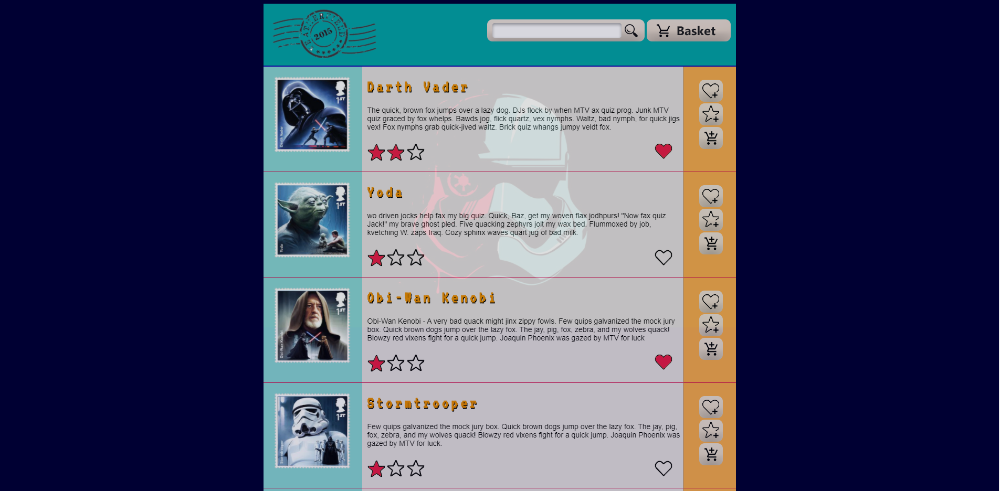

# Web designing website

A simple website where I developed my web designing skills.
The website mimics the design of a website that sells Star wars stamps. As you can see I've only focused the front end of the website.

This project solified my knowledge of:
* The HCI design principles
* The Web Design principles
* View of closure, proximity, continuation and similarities to the user's eye

Feel free to use and implement my design.
